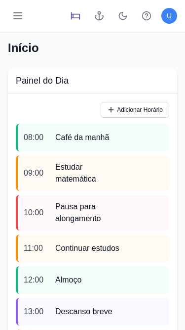
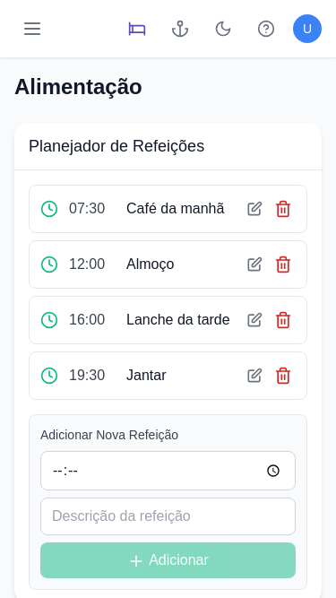
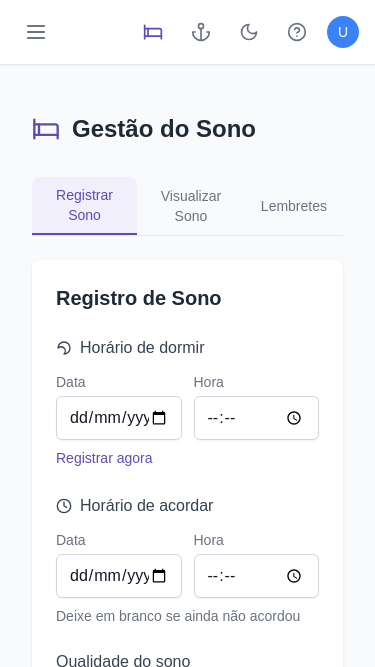
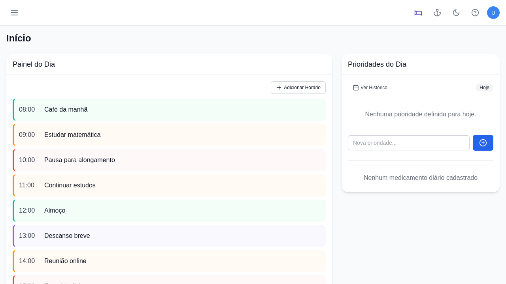
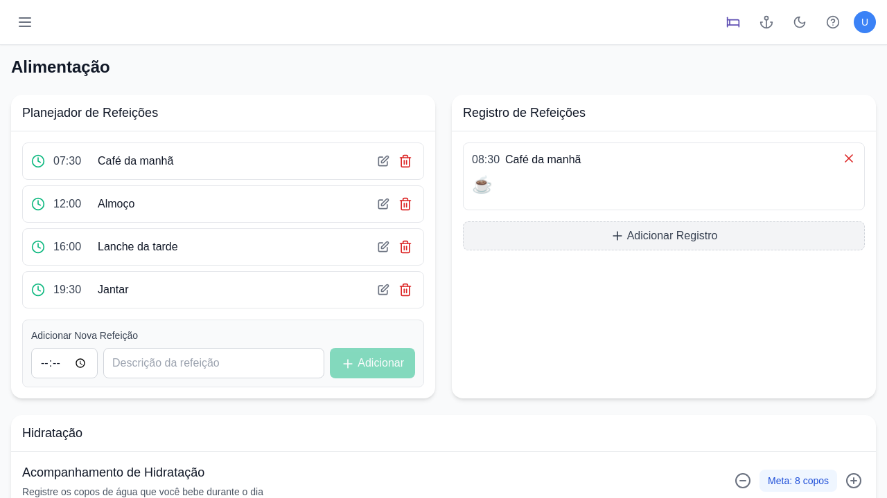
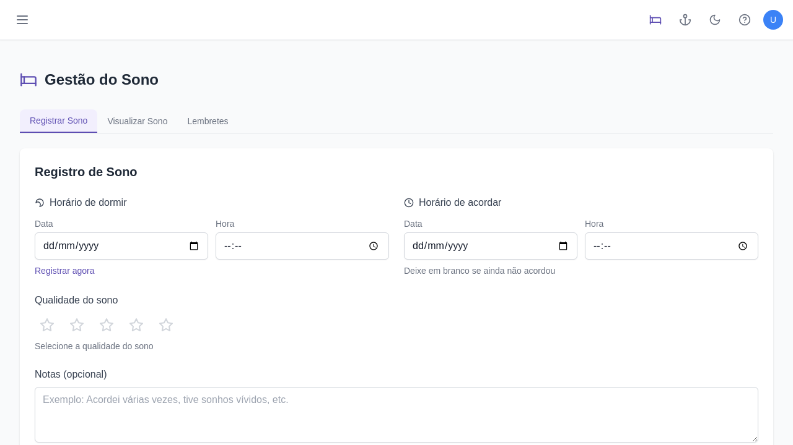

# Análise Comparativa Visual das Páginas do StayFocus

Este documento apresenta uma análise visual comparativa das diferentes páginas do aplicativo StayFocus, destacando aspectos de design, consistência e acessibilidade.

## Páginas Analisadas

1. [Página Inicial](#home)
2. [Alimentação](#alimentacao)
3. [Sono](#sono)
4. [Lazer](#lazer)
5. [Estudos](#estudos)
6. [Saúde](#saude)
7. [Finanças](#financas)
8. [Hiperfocos](#hiperfocos)
9. [Autoconhecimento](#autoconhecimento)
10. [Roadmap](#roadmap)
11. [Perfil](#perfil)
12. [Ajuda](#ajuda)

## Consistência Visual

### Quantidade de Elementos Interativos por Página

| Página | Botões | Elementos Interativos | Proporção |
|--------|--------|------------------------|-----------|
| Página Inicial | 35 | 41 | 85% |
| Alimentação | 21 | 28 | 75% |
| Sono | 16 | 26 | 62% |
| Lazer | 13 | 20 | 65% |
| Estudos | 16 | 21 | 76% |
| Saúde | 41 | 46 | 89% |
| Finanças | 25 | 32 | 78% |
| Hiperfocos | 20 | 29 | 69% |
| Autoconhecimento | 11 | 17 | 65% |
| Roadmap | 6 | 11 | 55% |
| Perfil | 16 | 23 | 70% |
| Ajuda | 6 | 12 | 50% |

### Conformidade com Acessibilidade

| Página | Botões com aria-label | Total de Botões | Porcentagem |
|--------|------------------------|-----------------|-------------|
| Página Inicial | 35 | 35 | 100% |
| Alimentação | 17 | 21 | 81% |
| Sono | 11 | 16 | 69% |
| Lazer | 11 | 13 | 85% |
| Estudos | 14 | 16 | 88% |
| Saúde | 41 | 41 | 100% |
| Finanças | 21 | 25 | 84% |
| Hiperfocos | 18 | 20 | 90% |
| Autoconhecimento | 8 | 11 | 73% |
| Roadmap | 6 | 6 | 100% |
| Perfil | 9 | 16 | 56% |
| Ajuda | 6 | 6 | 100% |

## Inconsistências Principais

### Paleta de Cores

Embora haja um conjunto principal de cores usadas em todas as páginas, identificamos várias inconsistências:

- **7 cores de texto principais** usadas em 100% das páginas
- **3 cores de fundo principais** usadas em 100% das páginas
- **10+ cores secundárias** usadas em menos de 80% das páginas

### Estrutura das Páginas

Cada página apresenta uma estrutura única de cabeçalhos, com total de 12 padrões diferentes para 12 páginas. Isso pode dificultar a familiaridade do usuário com a aplicação.

## Recomendações de Melhoria

### 1. Padronização de Cores

Recomendamos reduzir a paleta para:

- **Cores Primárias**: rgb(93, 77, 178) - roxo
- **Cores Secundárias**: rgb(59, 130, 246) - azul
- **Cores para Alertas/Ações**: rgb(239, 68, 68) - vermelho
- **Cores Neutras**: Preto, branco e no máximo 2 tons de cinza

### 2. Estrutura Consistente

Recomendamos padronizar a estrutura de todas as páginas seguindo um modelo similar:

```
H1: Nome da Seção
H2: Subseção Principal 1
H3: Componentes da Subseção 1
H2: Subseção Principal 2
...
```

### 3. Melhorias de Acessibilidade

As seguintes páginas precisam de atenção prioritária para implementação de aria-labels:

1. **Perfil**: 56% de conformidade
2. **Sono**: 69% de conformidade
3. **Autoconhecimento**: 73% de conformidade

### 4. Densidade de Informação

Há uma disparidade significativa na quantidade de elementos interativos entre páginas:

- **Saúde**: 46 elementos (alta densidade)
- **Ajuda**: 12 elementos (baixa densidade)

Recomendamos equilibrar a densidade de informação para manter a carga cognitiva mais consistente entre páginas.

## Conclusão

O StayFocus apresenta uma base sólida para uma aplicação voltada para usuários neurodivergentes, com boa acessibilidade e design visualmente agradável. No entanto, a falta de um sistema de design consistente entre as páginas pode comprometer a experiência do usuário.

Recomendamos o desenvolvimento de um guia de estilo detalhado e um conjunto de componentes reutilizáveis para garantir maior consistência em toda a aplicação.

---

## <a name="screenshots"></a>Screenshots Comparativos

### Mobile (375px)

Comparação da visualização mobile entre a página inicial, alimentação e sono:

| Página Inicial | Alimentação | Sono |
|----------------|-------------|------|
|  |  |  |

### Desktop (1280px)

Comparação da visualização desktop entre a página inicial, alimentação e sono:

| Página Inicial | Alimentação | Sono |
|----------------|-------------|------|
|  |  |  | 